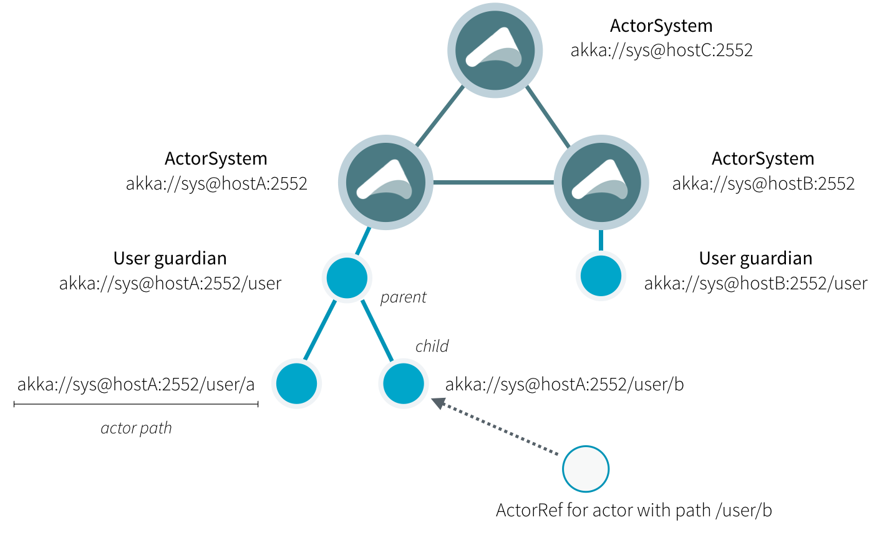

# Actor 引用、路径和地址
本章描述如何在可能的分布式 Akka 应用程序中识别和定位actor。 



上图显示了 Actor 系统中最重要的实体之间的关系，有关详细信息，请继续阅读。

## 什么是Actor的引用？
Actor 引用是`ActorRef`的一个子类型，其首要目的是支持将消息发送给它所代表的 Actor。每个 Actor 都可以通过`ActorContext.self`字段访问其规范（本地）引用；此引用可以包含在发送给其他actor的消息中以获取回复。

根据 Actor 系统的配置，支持几种不同类型的 Actor 引用：

- 纯本地 Actor 引用由未配置为支持网络功能的 Actor 系统使用。如果通过网络连接发送到远程 JVM，这些 Actor 引用将不起作用。
- 启用远程处理时，支持网络功能的 Actor 系统使用本地 Actor 引用，这些引用表示同一个 JVM 中的 Actor。为了在发送到其他网络节点时也可以访问，这些引用包括协议和远程寻址信息。
- 本地 Actor 引用的一个子类型用于路由器（即 Actor 混合在`Router`特性中）。它的逻辑结构与前面提到的本地引用相同，但是向它们发送消息会直接发送给它们的一个子级。
- 远程 Actor 引用表示可以使用远程通信访问的 Actor，即向其发送消息将透明地序列化消息并将其发送到远程 JVM。
- 有几种特殊类型的 Actor 引用，其行为类似于所有实际用途的本地 Actor 引用：
  - `PromiseActorRef`是一个`Promise`为了完成 Actor 响应的特殊表示。`akka.pattern.ask`创建这个 Actor 引用。
  - `DeadLetterActorRef`是死信服务的默认实现，Akka 将其目的地关闭或不存在的所有消息路由到该服务。
  - `EmptyLocalActorRef`是 Akka 在查找不存在的本地 Actor 路径时返回的：它相当于一个`DeadLetterActorRef`，但它保留了自己的路径，以便 Akka 可以通过网络发送它，并将其与该路径的其他现有 Actor 引用进行比较，其中一些引用可能是在 Actor 死亡之前获得的。
- 还有一些一次性（`one-off`）的内部实现，你应该永远都不会真正看到：
  - 有一个 Actor 引用，它不代表一个 Actor，只作为根守护者的伪监督者（`pseudo-supervisor`），我们称之为“the one who walks the bubbles of space-time（在时空的气泡中行走的人）”。
  - 在实际启动 Actor 创建工具之前启动的第一个日志记录服务是一个假 Actor 引用，它接受日志事件并将其直接打印到标准输出；它是`Logging.StandardOutLogger`。

## 什么是Actor路径？

由于 Actor 是以严格的层次结构方式创建的，因此存在一个唯一的 Actor 名称序列，该序列通过递归地沿着子级和父级之间的监督链接向下到 Actor 系统的根来给出。这个序列可以看作是文件系统中的封闭文件夹，因此我们采用名称`path`来引用它，尽管 Actor 层次结构与文件系统层次结构有一些基本的区别。

一个 Actor 路径由一个锚点组成，该锚点标识 Actor 系统，然后连接从根守护者到指定的 Actor 的路径元素；路径元素是被遍历的 Actor 的名称，由斜线分隔。

### Actor 的引用和路径有什么区别？
Actor 引用指定一个单独的 Actor，引用的生命周期与该 Actor 的生命周期匹配；Actor 路径表示一个可能由 Actor 位置或不由 Actor 位置标识的名称，并且路径本身没有生命周期，它永远不会变为无效。你可以在不创建 Actor 的情况下创建 Actor 路径，但在不创建相应的 Actor 的情况下无法创建 Actor 引用。

你可以创建一个 Actor，终止它，然后使用相同的 Actor 路径创建一个新的 Actor。新创建的 Actor 是原 Actor 的化身。他们不是同一个 Actor。Actor 引用旧的化身对新的化身无效。发送到旧 Actor 引用的消息将不会传递到新的化身，即使它们具有相同的路径。

### Actor 路径锚点
每个 Actor 路径都有一个地址组件，描述了协议和位置，通过这些协议和位置可以访问相应的 Actor，路径中的元素是从根目录向上的层次结构中 Actor 的名称。例如：

```
"akka://my-sys/user/service-a/worker1"                   // purely local
"akka.tcp://my-sys@host.example.com:5678/user/service-b" // remote
```

主机和端口部分的解释（即在示例中的`host.example.com:5678`）取决于所使用的传输机制，但它必须遵守 URI 结构规则。

### 逻辑 Actor 路径
通过跟踪指向根守护者的父级监督链接获得的唯一路径称为逻辑 Actor 路径。此路径与 Actor 的创建祖先完全匹配，因此只要设置了 Actor 系统的远程处理配置（以及路径的地址组件），它就完全具有确定性。

### Actor 路径别名或符号链接？

在一些实际的文件系统中，你可能会想到一个 Actor 的“路径别名”或“符号链接”，即一个 Actor 可以使用多个路径访问。但是，你应该注意，Actor 层次结构不同于文件系统层次结构。不能自由地创建 Actor 路径（如符号链接）来引用任意的 Actor。

## 如何获得Actor引用？
关于如何获得演员引用，有两个一般类别：通过[创建Actor](../typed/actor-lifecycle.md#创建Actors)或通过[接待员](../typed/actor-discovery.md#receptionist)查找他们。

## Actor引用和路径的等价性

`ActorRef`和一个`ActorRef`对应的目标actor具有相等性。当两个 actor 引用具有相同的路径并指向相同的 actor 化身时，它们被比较为相等。指向已终止actor的引用与指向具有相同路径的另一个（重新创建的）actor的引用不相等（译者：虽然路径相同但是 actor 的标识符不相同）。但是请注意，由故障引起的 actor 的重启仍然意味着它是同一个 actor 的化身，即重启对于`ActorRef`的用户端而言时不可见的.

如果您需要跟踪集合中的 actor 引用并且不关心确切的 actor 化身，您可以将`ActorPath`做为一个键，因为在比较 actor 路径时不会考虑目标 actor 的标识符。

## 重用Actor路径

当一个 actor 被终止时，它的引用将指向死信邮箱，DeathWatch 将发布它的最终转换，并且一般来说它不会再次复活（因为 actor 生命周期不允许这样做）。

## 地址部分是做什么用的？

通过网络发送actor引用时，它由其路径来表示。因此，路径必须将向下一级actor发送消息所需的所有信息进行完全编码。这是通过在路径字符串的地址部分编码协议、主机和端口来实现的。当actor系统从远程节点接收actor路径时，它会检查该路径的地址是否与此actor系统的地址匹配，在匹配的情况下，它将被解析为actor 的本地引用。否则，它被认为是一个远程actor引用。

## Actor路径的顶级范围

在路径层次结构的根部是根守护者，在其上可以找到所有其他actor；它的名字是`"/"`. 下一个级别包括以下内容：

- `"/user"`是所有用户创建的顶级actor的守护actor；可以在下面找到使用`ActorSystem.actorOf`（原文错误，对 typed actor 而言应该是  `context.spawn`）创建的所有actor。
- `"/system"` 是所有系统创建的顶级actor 的守护actor，例如在actor 系统启动时通过配置自动部署的日志监听器或其它actor。
- `"/deadLetters"` 是死信actor，它是所有发送到已停止或不存在的actor的消息重新路由的地方（尽最大努力：即使在本地JVM中消息也可能丢失）。
- `"/temp"`是所有系统创建的短期actor的守护者，例如那些用于实现`ActorRef.ask` 的 actor。
- `"/remote"` 是一个人工路径，它的下面是那些监督者是远程actor引用的actor

像这样为 actor 构建名称空间的需求源于一个中心化的且非常简单的设计目标：层次结构中的一切都是一个 actor，并且所有 actor 都以相同的方式运行。 

----------

[位置透明](remoting.md)

----------
**英文原文链接**：[Actor References, Paths and Addresses](https://doc.akka.io/docs/akka/current/general/addressing.html).