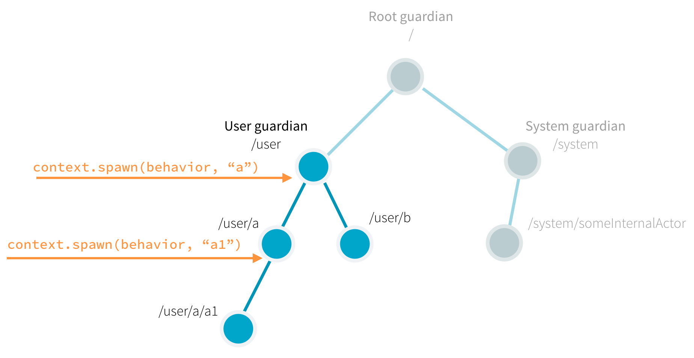

# 第 1 部分: Actor 的体系结构
## 依赖
在你的项目中添加如下依赖：

```xml
<!-- Maven -->
<properties>
  <scala.binary.version>2.13</scala.binary.version>
</properties>
<dependencyManagement>
  <dependencies>
    <dependency>
      <groupId>com.typesafe.akka</groupId>
      <artifactId>akka-bom_${scala.binary.version}</artifactId>
      <version>2.6.15</version>
      <type>pom</type>
      <scope>import</scope>
    </dependency>
  </dependencies>
</dependencyManagement>
<dependencies>
  <dependency>
    <groupId>com.typesafe.akka</groupId>
    <artifactId>akka-actor-typed_${scala.binary.version}</artifactId>
  </dependency>
</dependencies>

<!-- Gradle -->
def versions = [
  ScalaBinary: "2.13"
]
dependencies {
  implementation platform("com.typesafe.akka:akka-bom_${versions.ScalaBinary}:2.6.15")
  implementation "com.typesafe.akka:akka-actor-typed_${versions.ScalaBinary}"
}

<!-- sbt -->
val AkkaVersion = "2.6.15"
libraryDependencies += "com.typesafe.akka" %% "akka-actor-typed" % AkkaVersion
```

## 简介
使用 Akka 可以让你从为 Actor 系统创建基础设施和编写控制基本行为所需的初级（`low-level`）代码中解脱出来。为了理解这一点，让我们看看你在代码中创建的 Actor 与 Akka 在内部为你创建和管理的 Actor 之间的关系，Actor 的生命周期和失败处理。

## Akka的Actor层级
Akka 的 Actor 总是属于父 Actor。通常，你可以通过调用`ActorContext().spawn()`来创建 Actor。创建 Actor 的 Actor 成为新创建的子 Actor 的父级。那么你可能会问，第一个 Actor 的父节点是谁？

如下图所示，所有的 Actor 都有一个共同的父节点，即用户监护人(`guardian`)。它在您启动 ActorSystem 时定义并创建。正如我们在[快速入门指南中介绍的那样](../quickstart-akka-scala.md)，actor 的创建会返回一个有效的 URL引用。例如，如果我们从User guardian 中创建一个以`someActor`命名的 actor `context.spawn(someBehavior, "someActor")`，它的引用将包含 path `/user/someActor`。



事实上，你在代码中创建 Actor 之前，Akka 已经在系统中创建了两个Actor 。（注原文：In fact, before your first actor is started, Akka has already created **`two`** actors in the system.）这些内置的 Actor 的名字包含`guardian`，guardian Actor 包括：

- `/`：根监护人（`root guardian`）。这是系统中所有 Actor 的父 Actor，也是系统本身终止时要停止的最后一个 Actor。
- `/system`：该系统的监护人（`system guardian`）。Akka 或其他建立在 Akka 之上的库可能会在*system*命名空间中创建角色。
- `/user`：用户监护人（`guardian`）。这是您用来启动所有其他应用程序中的actor的顶级监护人。

查看角色层次结构的最简单方法是打印`ActorRef`实例。在这个小实验中，我们将创建一个actor，打印了它的引用，然后创建这个actor的一个子元素，然后打印这个actor的引用。我们从 Hello World 项目开始，如果您还没有下载它，请从[Lightbend Tech Hub](https://developer.lightbend.com/start/?group=akka&project=akka-quickstart-scala&_ga=2.236947649.1982410223.1624840999-1885200556.1624035854)下载 Quickstart 项目。

在你的`Hello World`项目中，导航到`com.example`包并创建一个新的名为`ActorHierarchyExperiments.java`的 Scala文件。将下面代码段中的代码复制并粘贴到此新源文件中。保存文件并运行`sbt "runMain com.example.ActorHierarchyExperiments"`来观察输出。

```scala
ackage com.example

import akka.actor.typed.ActorSystem
import akka.actor.typed.Behavior
import akka.actor.typed.scaladsl.AbstractBehavior
import akka.actor.typed.scaladsl.ActorContext
import akka.actor.typed.scaladsl.Behaviors

object PrintMyActorRefActor {
  def apply(): Behavior[String] =
    Behaviors.setup(context => new PrintMyActorRefActor(context))
}

class PrintMyActorRefActor(context: ActorContext[String]) extends AbstractBehavior[String](context) {

  override def onMessage(msg: String): Behavior[String] =
    msg match {
      case "printit" =>
        val secondRef = context.spawn(Behaviors.empty[String], "second-actor")
        println(s"Second: $secondRef")
        this
    }
}

object Main {
  def apply(): Behavior[String] =
    Behaviors.setup(context => new Main(context))

}

class Main(context: ActorContext[String]) extends AbstractBehavior[String](context) {
  override def onMessage(msg: String): Behavior[String] =
    msg match {
      case "start" =>
        val firstRef = context.spawn(PrintMyActorRefActor(), "first-actor")
        println(s"First: $firstRef")
        firstRef ! "printit"
        this
    }
}

object ActorHierarchyExperiments extends App {
  val testSystem = ActorSystem(Main(), "testSystem")
  testSystem ! "start"
}
```
注意信息要求第一个 Actor 完成工作的方式。我们使用父 Actor 的引用发送消息`firstRef ！"printit"`。当代码执行时，输出包括第一个 Actor 的引用，以及在类型匹配`printit`时创建的子 Actor 的引用。你的输出应该与下面的内容相似：

```
First: Actor[akka://testSystem/user/first-actor#1053618476]
Second: Actor[akka://testSystem/user/first-actor/second-actor#-1544706041]
```
注意 Actor 引用的结构：

- 两条路径都以`akka://testSystem/`开头。因为所有 Actor 的引用都是有效的 URL，所以`akka://`是协议字段的值。
- 接下来，就像在万维网（`World Wide Web`）上一样，URL 标识系统。在本例中，系统名为`testSystem`，但它可以是任何其他名称。如果启用了多个系统之间的远程通信，则 URL 的这一部分包括主机名，以便其他系统可以在网络上找到它。
- 因为第二个 Actor 的引用包含路径`/first-actor/`，这个标识它为第一个 Actor 的子 Actor。
- Actor 引用的最后一部分，即`#1053618476`或`#-1544706041`是一个在大多数情况下可以忽略的唯一标识符。

现在你了解了 Actor 层次结构的样子，你可能会想：为什么我们需要这个层次结构？它是用来干什么的？

层次结构的一个重要作用是安全地管理 Actor 的生命周期。接下来，我们来考虑一下，这些知识如何帮助我们编写更好的代码。

### Actor的生命周期
Actor 在被创建时就会出现，然后在用户请求时被停止。每当一个 Actor 被停止时，它的所有子 Actor 也会被递归地停止。这种行为大大简化了资源清理，并有助于避免诸如由打开的套接字和文件引起的资源泄漏。事实上，在处理初级多线程代码时，一个通常被忽视的困难是各种并发资源的生命周期管理。

要停止 Actor，建议的模式是返回 Actor 内部的 Behaviors.stopped() 来停止自身，通常调用发生在响应某些用户定义的停止消息，或者当 Actor 完成其任务时。从技术上讲，通过`context.stop(childRef)`从父级调用来停止子 Actor 是可能的，但不可能以这种方式停止任意（非子级）Actor 。

Akka Actor 的 API 暴露了一些生命周期信令，例如`PostStop` 在 actor 停止后被立刻发送。在此之后不会处理任何消息。

让我们使用`PostStop`生命周期信号在一个简单的实验中来观察我们停止 Actor 时的行为。首先，将以下 2 个Actor 类添加到您的项目中：

```scala
object StartStopActor1 {
  def apply(): Behavior[String] =
    Behaviors.setup(context => new StartStopActor1(context))
}

class StartStopActor1(context: ActorContext[String]) extends AbstractBehavior[String](context) {
  println("first started")
  context.spawn(StartStopActor2(), "second")

  override def onMessage(msg: String): Behavior[String] =
    msg match {
      case "stop" => Behaviors.stopped
    }

  override def onSignal: PartialFunction[Signal, Behavior[String]] = {
    case PostStop =>
      println("first stopped")
      this
  }

}

object StartStopActor2 {
  def apply(): Behavior[String] =
    Behaviors.setup(new StartStopActor2(_))
}

class StartStopActor2(context: ActorContext[String]) extends AbstractBehavior[String](context) {
  println("second started")

  override def onMessage(msg: String): Behavior[String] = {
    // no messages handled by this actor
    Behaviors.unhandled
  }

  override def onSignal: PartialFunction[Signal, Behavior[String]] = {
    case PostStop =>
      println("second stopped")
      this
  }

}
```

接下来，创建一个主函数来启动 Actors，然后向他们发送`stop`消息：

```java
val first = context.spawn(StartStopActor1(), "first")
first ! "stop"
```
你可以再次使用`sbt`命令来启动这个项目，其输出结果应该如下面这样：

```
first started
second started
second stopped
first stopped
```

当我们停止`first` Actor 时，它会在停止自身之前，先停止了它的子 Actor `second`。这个顺序是严格的，，在处理父级的信号之前，先处理子级的*所有* `PostStop`信号`PostStop`。

### 失败处理

父 Actor 和子 Actor 在他们的生命周期中是相互联系的。当一个 Actor 失败（抛出一个异常或从  onMessage 中冒出一个未处理的异常）时，失败信息就会传播给监督策略，然后由监督策略决定如何处理由 Actor 引起的异常。监督策略通常由父 actor 在生成子 actor 时定义。这样，父母就充当了孩子的监督者。默认的*主管策略*是 stop 孩子。如果您没有定义策略，所有失败都会导致停止。

让我们在一个简单的实验中观察默认策略。将下面的类添加到项目中，就像之前的类一样：

```java
object SupervisingActor {
  def apply(): Behavior[String] =
    Behaviors.setup(context => new SupervisingActor(context))
}

class SupervisingActor(context: ActorContext[String]) extends AbstractBehavior[String](context) {
  private val child = context.spawn(
    Behaviors.supervise(SupervisedActor()).onFailure(SupervisorStrategy.restart),
    name = "supervised-actor")

  override def onMessage(msg: String): Behavior[String] =
    msg match {
      case "failChild" =>
        child ! "fail"
        this
    }
}

object SupervisedActor {
  def apply(): Behavior[String] =
    Behaviors.setup(context => new SupervisedActor(context))
}

class SupervisedActor(context: ActorContext[String]) extends AbstractBehavior[String](context) {
  println("supervised actor started")

  override def onMessage(msg: String): Behavior[String] =
    msg match {
      case "fail" =>
        println("supervised actor fails now")
        throw new Exception("I failed!")
    }

  override def onSignal: PartialFunction[Signal, Behavior[String]] = {
    case PreRestart =>
      println("supervised actor will be restarted")
      this
    case PostStop =>
      println("supervised actor stopped")
      this
  }

}
```
然后运行：
```java
val supervisingActor = context.spawn(SupervisingActor(), "supervising-actor")
supervisingActor ! "failChild"
```
你应该看到类似如下的输出结果：

```
supervised actor started
supervised actor fails now
supervised actor will be restarted
supervised actor started
[ERROR] [11/12/2018 12:03:27.171] [ActorHierarchyExperiments-akka.actor.default-dispatcher-2] [akka://ActorHierarchyExperiments/user/supervising-actor/supervised-actor] Supervisor akka.actor.typed.internal.RestartSupervisor@1c452254 saw failure: I failed!
java.lang.Exception: I failed!
	at typed.tutorial_1.SupervisedActor.onMessage(ActorHierarchyExperiments.scala:113)
	at typed.tutorial_1.SupervisedActor.onMessage(ActorHierarchyExperiments.scala:106)
	at akka.actor.typed.scaladsl.AbstractBehavior.receive(AbstractBehavior.scala:59)
	at akka.actor.typed.Behavior$.interpret(Behavior.scala:395)
	at akka.actor.typed.Behavior$.interpretMessage(Behavior.scala:369)
	at akka.actor.typed.internal.InterceptorImpl$$anon$2.apply(InterceptorImpl.scala:49)
	at akka.actor.typed.internal.SimpleSupervisor.aroundReceive(Supervision.scala:85)
	at akka.actor.typed.internal.InterceptorImpl.receive(InterceptorImpl.scala:70)
	at akka.actor.typed.Behavior$.interpret(Behavior.scala:395)
	at akka.actor.typed.Behavior$.interpretMessage(Behavior.scala:369)
```
我们看到，在失败后，受监督的 actor 会停止并立即重新启动。我们还看到一个日志条目报告了它捕获的异常，在这个例子中，它是我们抛出的测试异常。在这个例子中，我们还使用了`PreRestart`信号来做重新启动之前的处理。

无论如何，我们还是建议查看「[容错参考](https://doc.akka.io/docs/akka/current/typed/fault-tolerance.html)」，以了解更深入的细节。

## 总结
我们已经了解了 Akka 如何在父母监督孩子并处理异常的层次结构中管理 Actor。我们看到了如何创造一个非常简单的 Actor 和其子 Actor。接下来，我们将这些知识应用到通信建模中，以从 device actor 中获取信息所需信息。稍后，我们将处理如何分组管理actor。

----------

[第 2 部分：创建第一个 Actor ](tutorial_2.md)

----------

**英文原文链接**：[Part 1: Actor Architecture](https://doc.akka.io/docs/akka/current/guide/tutorial_1.html).